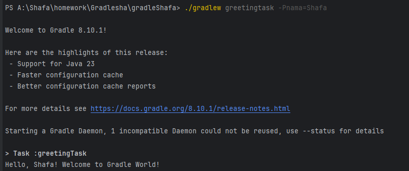

# HOMEWORK GRADLE

## DESKRIPSI PROJECT 
   Project ini adalah project Gradle sederhana untuk menerima parameter CLI dan mencetaknya sebagai pesan ucapan "-your_name- Welcome to Gradle World!"
   
## CARA RUN PROJECT
- buka root folder project 
- buka file build.gradle
- klik run di task greetingTask atau 
- buka terminal dan jalankan "./gradlew greetingtask -Pnama=[Your Name]"

## HASIL RUN PROJECT

